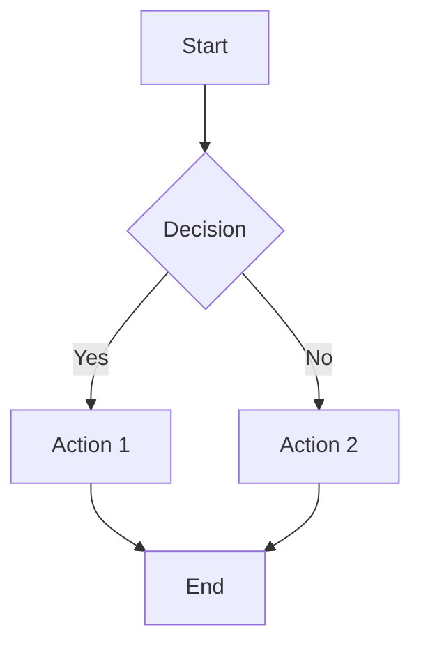
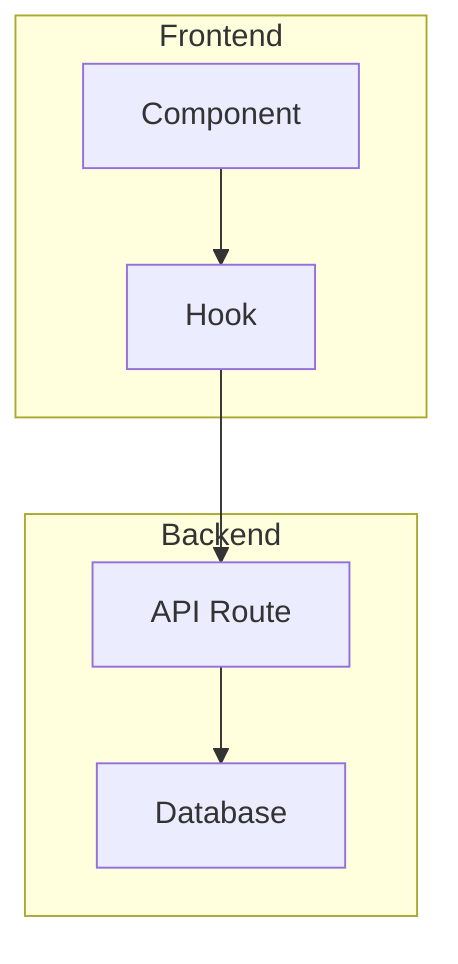
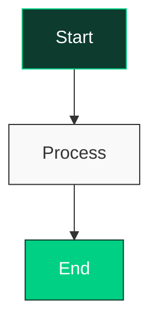

# Documentation Site - Maintenance Guide

> **Location:** `/docs-site/`  
> **Live URL:** https://zuma-docs.vercel.app (after deployment)  
> **Related:** `/docs/APP_LOGIC.md` (source of truth for flowcharts)

---

## ⚠️ CRITICAL: Synchronization Requirement

**This docs-site contains INTERACTIVE flowcharts that MUST stay in sync with:**

1. **`/docs/APP_LOGIC.md`** - ASCII flowcharts (source of truth)
2. **`/docs/PROJECT_STATUS.md`** - Feature status and changes
3. **Actual code implementation** in the app

### When Application Logic Changes:

```
┌─────────────────────────────────────────────────────────────┐
│  WHEN YOU UPDATE APPLICATION LOGIC:                        │
│                                                             │
│  1. Update /docs/APP_LOGIC.md ASCII flowcharts             │
│  2. Update /docs-site/flows/*.html Mermaid diagrams        │
│  3. Update /docs/PROJECT_STATUS.md status                  │
│  4. Update /docs/AI_REFERENCE.md if navigation changes     │
│                                                             │
│  ⚠️ NEVER update only one - keep all in sync!              │
└─────────────────────────────────────────────────────────────┘
```

---

## File Structure

```
docs-site/
├── index.html              # Main landing page with navigation
├── styles.css              # Shared styles and theming
├── vercel.json             # Deployment configuration
├── README.md               # This file
└── flows/                  # Individual flowchart pages
    ├── ro-lifecycle.html
    ├── create-ro.html
    ├── process-ro.html
    ├── dnpb-matching.html
    ├── dnpb-error.html
    ├── stock-calculation.html
    ├── authentication.html
    └── api-overview.html
```

---

## Adding a New Flowchart

### 1. Create the HTML File

Copy an existing flow file (e.g., `flows/create-ro.html`) and modify:

```html
<!-- flows/new-flow.html -->
<!DOCTYPE html>
<html lang="en">
<head>
    <meta charset="UTF-8">
    <title>New Flow - Zuma RO PWA</title>
    <script src="https://cdn.jsdelivr.net/npm/mermaid@10/dist/mermaid.min.js"></script>
    <link rel="stylesheet" href="../styles.css">
</head>
<body>
    <div class="flow-container">
        <header>
            <a href="../index.html">← Back to Overview</a>
            <h1>New Flow Title</h1>
        </header>
        
        <div class="mermaid">
graph TD
    A[Start] --> B[Step 1]
    B --> C[Step 2]
    C --> D[End]
        </div>
        
        <div class="explanation">
            <h2>Explanation</h2>
            <p>Describe what this flowchart shows...</p>
        </div>
    </div>
    
    <script>
        mermaid.initialize({
            startOnLoad: true,
            theme: 'default',
            flowchart: {
                useMaxWidth: true,
                htmlLabels: true
            }
        });
    </script>
</body>
</html>
```

### 2. Add to Index Page

Update `index.html` to include the new flowchart card:

```html
<a href="flows/new-flow.html" class="flowchart-card">
    <div class="flowchart-icon">
        <svg>...icon svg...</svg>
    </div>
    <h3>New Flow Title</h3>
    <p>Brief description...</p>
    <span class="badge">Category</span>
</a>
```

### 3. Update APP_LOGIC.md

Add the corresponding ASCII flowchart to `/docs/APP_LOGIC.md`:

```markdown
## New Flow

```
[ASCII flowchart here]
```
```

### 4. Update PROJECT_STATUS.md

If this is a new feature, update the status in `/docs/PROJECT_STATUS.md`.

---

## Mermaid Syntax Reference

### Basic Flowchart



### Subgraphs



### Styling



### Colors (Zuma Brand)

- Primary Dark: `#0D3B2E`
- Accent Green: `#00D084`
- Light Gray: `#f9f9f9`
- Border: `#333` or `#ddd`

---

## Deployment

### To Vercel:

```bash
# From project root
cd docs-site
vercel --prod

# Or link to existing project
vercel link
vercel --prod
```

### Configuration (vercel.json)

```json
{
  "version": 2,
  "name": "zuma-docs",
  "routes": [
    { "src": "/(.*)", "dest": "/$1" }
  ]
}
```

---

## Checklist for Updates

Before committing changes to docs-site:

- [ ] Updated corresponding `/docs/APP_LOGIC.md` ASCII flowchart
- [ ] Updated `/docs/PROJECT_STATUS.md` if feature status changed
- [ ] Tested all links work correctly
- [ ] Verified Mermaid diagrams render properly
- [ ] Checked mobile responsiveness
- [ ] Updated version number if needed

---

## Version History

| Date | Version | Changes |
|------|---------|---------|
| 2026-02-05 | 1.0.0 | Initial docs-site creation with 8 flowcharts |

---

*This documentation site is maintained alongside the main Zuma RO PWA application.*  
*For questions, see `/docs/AI_REFERENCE.md` for complete navigation.*
